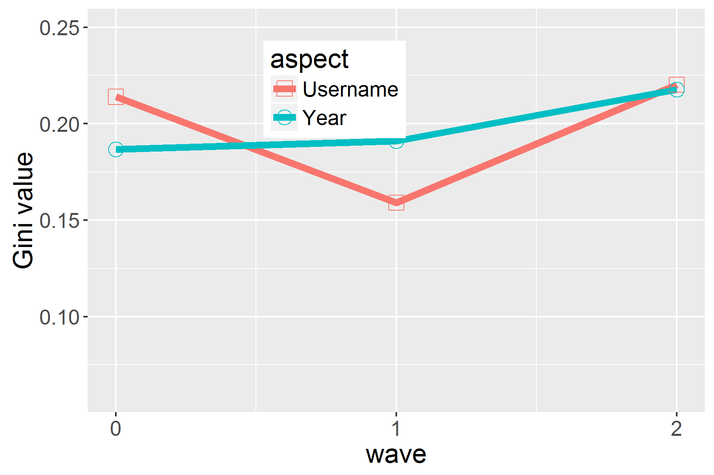

# GraphBoot

A Spark/Scala implementation of boostrap sampling on networks. 

Sampling nodes and their features in scalable, efficient and reliable ways is of critical importance for analysis of modern complex networks. Given a very limited availability of network data, how much data should be queried from the network, and how should the sampling process be designed? Which node features can be estimated and which cannot? More importantly, once these decisions are made, how can we evaluate the reliability of sampling? 

GraphBoot proposes the first solution to quantifying the uncertainty in estimating node features. We propose a new metric based on Gini index, enabling a sampler to assess how much information is needed in the sampling process. 

We demonstrate the effectiveness of our methodology with extensive simulations, experiments on real life social networks and a case study of Mental Health on Twitter.

Paper source will be shared after the final review. Below, you will find the results that were excluded due to space limitations.

<h1>Used Networks</h1>
<h2>Synthetic Graphs</h2>

Lognormal graphs

 

Rmat graphs

<h2>Real World Graphs</h2>

Citation Graphs (DBLP 2016)

Directed Graphs (Twitter 2010)

Undirected Graphs (Facebook New Orleans)

Signed Graphs (Epinions.com)

Twitter case study on Mental Health

